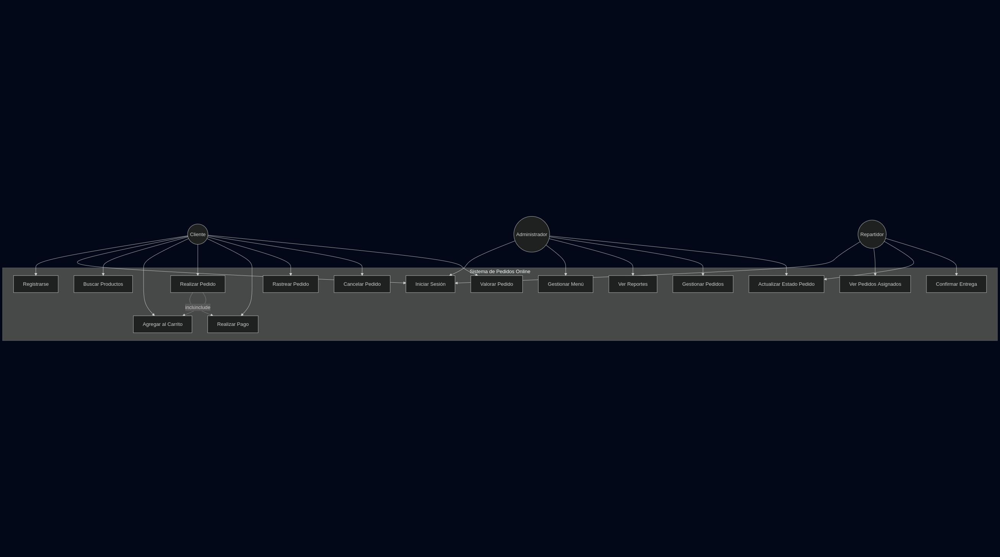
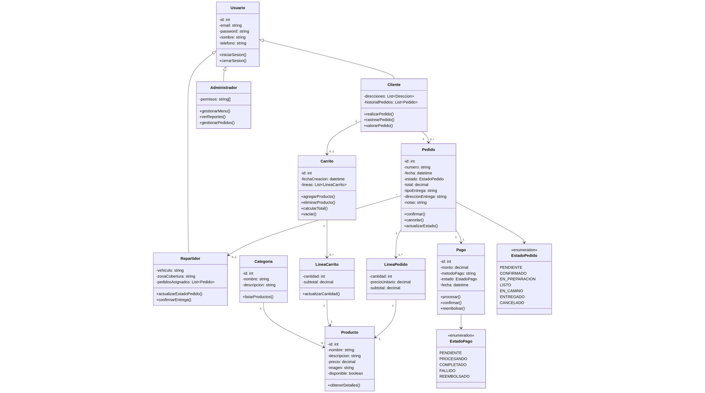
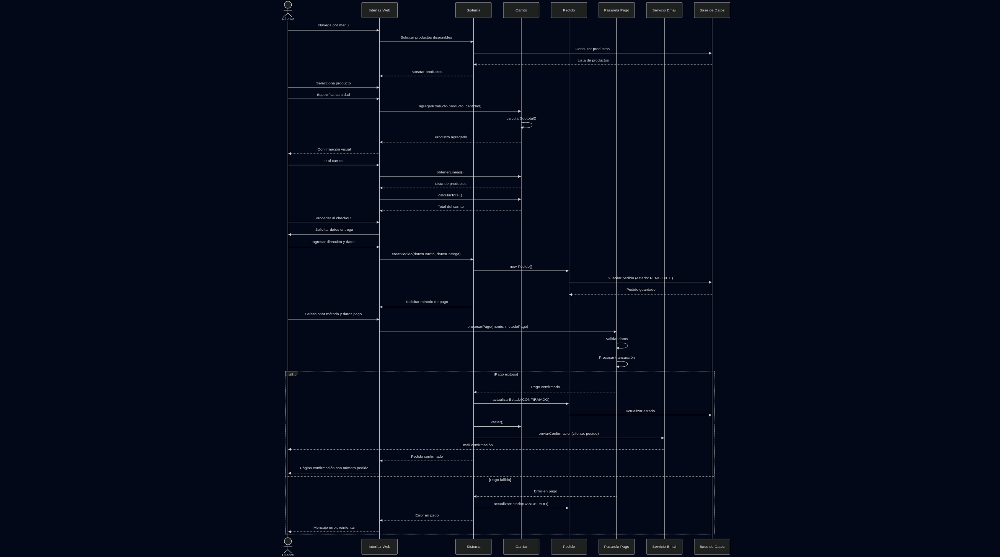

# PRÀCTICA 2: DISSENY

### Fet per:

* Biel Camarena

* Silvia Moreno

* Max Escrivá

---

# ÍNDEX

* [Objectius](#objectius)

* [Diagrames UML](#diagrames-uml-casos-dús-i-components)

* [Experiència d'usuari](#definició-de-lexperiència-de-lusuari-uxui)

---

# Objectius

Els objectius d'aquesta pràctica són:

1. Dissenyar l'arquitectura tècnica del projecte.

2. Crear diagrames UML basats en els requisits del projecte.

3. Desenvolupar interfícies intuïtives i atractives centrades en una experiència d'usuari fluïda i eficient.

4. Assgurar la coherència del disseny amb els objectius del projecte.

## Requisits:

| WEB                                     | Funcionalitat                                                                                                                                                                                                                                                                                          |
| --------------------------------------- | ------------------------------------------------------------------------------------------------------------------------------------------------------------------------------------------------------------------------------------------------------------------------------------------------------ |
| Pàgina d'inici / Homepage               | Presentar l'empresa, i diferents seccions: catàleg de productes disponibles, quines ofertes hi han, informació de contacte...                                                                                                                                                                          |
| Catàleg de productes                    | Carta de productes que ofereix l'empresa, fitxes detallades amb els plats, què alèrgens té, ingredients...                                                                                                                                                                                             |
| Contacte                                | Una pàgina senzilla on el client trobarà com contactar amb l'empresa per correu o telèfon i l'ubicació del local.                                                                                                                                                                                      |
| Àrea privada per als empleats i gestors | Accés mitjançant login segur (usuari i contrasenya), amb dos rols diferenciats: administrador (control total) i empleats (sols visualització). Ací es podrà accedir a la creació de torns semanals o mensuals, l'assignació dels empleats a torns, la visualització del horari per als treballadors... |

---

# Diagrames UML: Casos d'ús i components

Per a la nostra web, hem creat uns diagrames UML que contaran el procés d'interacció del client amb la nostra plataforma per a fer una comanda.

Per a crear aquests diagrames, hem utilizat l'eina web Mermaid.

Aquestes són les classes amb les que la nostra plataforma interactuarà.

I aquest el diagrama de secuència d'un cas de comanda del client, pasant per l'elecció del plat i el pagament fins a la confirmació de l'entrega.

> Nota per a Espe: si no veus bé les fotos, et puc enviar la carpeta de fotos de diagrames sense problema :) 
> 
> -- Max

---

# Definició de l'experiència de l'usuari (UX/UI)

Hem creat una pàgina d'inici amb diferents seccions: 

* Serveis

* Menú (Carta de plats)

* Informació sobre l'empresa

* Contacte

A més, hem afegit un botó al menú que portarà a l'àrea privada dels empleats i gestors. Ací no podrà accedir l'usuari.

Tal i com anem desplaçant la pàgina cap a dalt, aquestes seccions es mostraran en primer pla.

Dins del menú de serveis, tindrem dos opcions: "Recollida" o "Enviament a domicili", amb dos botons "*call to action*" per que l'usuari puga fer les comandes ràpidament.

Si continuem desplaçant, vorem els plats destacats i més populars, amb un altre botó "*call to action*" per accedir al menú complet.

Més abaix donem una ullada ràpida a la història de l'empresa i els seus valors.

Finalment, tenim la direcció, telèfon de contacte, email i horari de l'empresa, i també un formulari on l'usuari pot escriure un missatge, si així ho desitja.

Aquesta pàgina també l'hem fet perquè siga accesible i navegable des del *smartphone*, tal i com es veu en les *mockups* que hem creat.

Per últim, hem creat i guardat un logo amb fons transparent que podrem modificar i colorejar com vullgam.

Aquest logo, com es pot vore dalt, fa la forma d'una llar amb una forqueta y ganivet junts per crear un teulat, i un foc de cuina que completarà l'impressió d'una casa.
